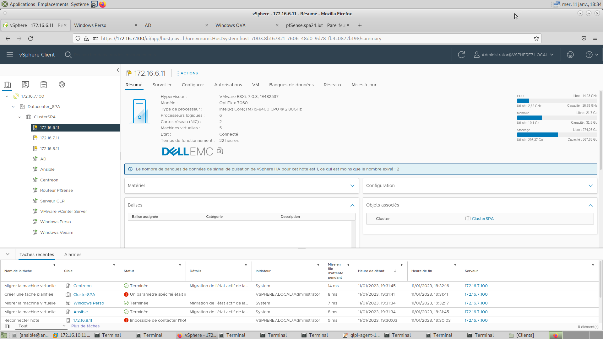

<!-- markdownlint-disable MD036 MD033 MD024 -->
<!-- omit in toc -->
# Compte Rendu DevCloud

**Titre - Compte Rendu Projet DevCloud**

**Auteur - Noilou Quentin**

**Créé le - 11 novembre 2022**

---

- [Introduction](#introduction)
- [Architecture](#architecture)
  - [Identifiants](#identifiants)
- [Mise en place](#mise-en-place)
  - [ESXs](#esxs)
  - [vCenter](#vcenter)
  - [Routeur](#routeur)
  - [GLPI](#glpi)
    - [Installation de GLPI](#installation-de-glpi)
    - [Installation des agents](#installation-des-agents)
  - [Centreon](#centreon)
    - [Installation](#installation)
  - [Active Directory](#active-directory)
  - [Ansible](#ansible)
  - [Switch physique](#switch-physique)
  - [Site Web](#site-web)
- [Tests](#tests)
- [PRA](#pra)
- [Comptes rendus de séances](#comptes-rendus-de-séances)
- [Conclusion](#conclusion)

<div class="page"/>
<div style="page-break-before: always;" />

<!-- omit in toc -->
## Lexique

| Abréviation  |  Signification                           |
|--------------|------------------------------------------|
| GLPI         | Gestionnaire Libre de Parc Informatique  |
|  HA          | Haute Disponibilité (High Availability)  |
| vSwitch      | Switch Virtuel (Virtual Switch), permet de créer des réseaux virtuels dans un environnement virtualisé                 |
|VLAN          |Réseau virtuel (Virtual LAN)              |
|VM            |Machine Virtuelle (Virtual Machine)       |
|DRS           |Distributed Resource Scheduling           |
|GUI           |Interface Homme-Machine (Graphical User Interface)|
|CLI           |Interface Ligne de Commande (Command Line Interface)|

<div class="page"/>
<div style="page-break-before: always;" />

## Introduction

---

Le professionnel Développement Système et Cloud doit :

- assurer l’installation de serveurs et d’un hyperviseur en choisissant une solution matérielle ou logicielle ;
- créer des machines virtuelles pour déployer différents services ;
- gérer des ressources matérielles, les ressources étant partagées entre différents services;
- assurer la maintenance et la performance des services qui peuvent être déplacés aisément d’un serveur à un autre ;
- assurer la reprise d’activité rapide en cas de panne, grâce à des outils de réplication ;
- exploiter les atouts d’une infrastructure virtualisée ;
- mesurer l’apport de la virtualisation, pour rendre compte à son entreprise d’indicateurs sur le
- fonctionnement du réseau ou orienter son entreprise vers des solutions de virtualisation.

Au cours de ce projet pour obtenir ces compétences, nous allons virtualiser une partie de notre projet réseau de 1ère année. Nous devons prendre en compte les points abordés en TP :

- Virtualisation de routeur
- Utilisation de la cli d'ESXi pour sauvegarder, configurer, restaurer (utilisé par Ansible ici)
- Mise en place de la Haute Disponibilité (HA)
- Installation d'un logiciel de gestion de parc informatique (GLPI)
- Installation d'un logiciel de supervision (Centreon)
- Equilibrage de la charge des hôtes : DRS

<div class="page"/>
<div style="page-break-before: always;" />

## Architecture

---

Dans ce projet, nous avons repris l'infrastructure de notre "projet réseau" de première année. Ce projet consistait en la conception d'une solution de réseau pour un entreprise type PME (ici un SPA). Ce projet ne prenait pas en compte la virtualisation, des modifications ont donc été apportées. En voici le schéma de dépannage initial :


Maintenant, voici l'infrastructure virtualisée que nous avons mis en place, Internet se trouvant derrière le routeur 172.16.0.1:


### Identifiants

Voici les identifiants utilisés dans la maquette.
J'ai conscience qu'il est nécessaire de les modifier pour ne pas utiliser les identifiants par défaut des machines.

- vCenter : 172.16.7.100 administrator@vsphere7.local:LPLannion1!
- ESXis : root:LPLannion1!
  - 172.16.6.11
  - 172.16.7.11
  - 172.16.8.11
- Routeur : 172.16.7.30 admin:pfsense
- Serveur GLPI : 192.16.10.10/glpi glpi:glpi  
- Centreon (défaut) admin:Centreon123!
- Centreon (natté) 172.16.7.30:3556 admin:centreon
- Centreon (non-natté&) 192.16.10.53/centreon/ admin:centreon
- Centreon (console) root:centreon
- Veeam Backup&Replication (Windows OVA) 192.16.20.101 etudiant:lannion

<!-- omit in toc -->
#### Identifiants AD

- Administrateur:lego-Constructions
- Directrice:Direction.

## Mise en place

---
Voici les étapes de la mise en place de cette infrastructure :

### ESXs

Pour mettre en place notre infrastructure virtualisée, nous avons utilisé les hyperviseurs de niveau 1 de chez VMware : les ESXis. Ce choix est motivé par le fait que c'est la solution que nous étudions en cours, mais également celle que j'utilise quotidiennement pendant mon alternance. Je suis donc à l'aise avec ce produit.
Cette solution, chapeautée par un vCenter Server, permet d'avoir plusieurs hôtes qui peuvent se servir de la Haute Disponibilité (HA) pour garantir une continuité de l'activité même si un hôte venait à ne plus être disponible.

Les ESXs étaient déjà installés sur les machines de la salle de TP. Nous n'avons donc eu qu'à installer notre configuration dessus.

Pour configurer nos ESXs, nous avions tout d'abord utilisé l'api disponible en ligne de commande : `esxcli`. Toutefois, cette option n'était pas « scalable » et nous devions nous connecter à chaque ESXs à chaque séance pour restaurer la configuration. Cette option était toutefois plus rapide que de configurer manuellement via l'interface Web.

Pour pallier à cette “scalabilité” et le temps perdu à se connecter à chaque machine, nous avons utilisé Ansible pour configurer les ESXs. Cette partie sera développée plus loin, dans la partie [Ansible](#ansible).

Pour revenir à la mise en place de l'infrastructure, nous avons déployé, sur chaque ESXs :

- un vSwitch avec des groupes de ports identiques pour chaque VLAN (Visibles dans le schéma de dépannage) et une interface réseau
- un datastore NFS commun, hébergé sur la machine 172.16.7.1:/DATA
- Les mêmes identifiants pour chaque hôte (simplifie Ansible)

Une fois cette configuration terminée, nous avons connecté l'interface du nouveau vSwitch à un Switch physique pour interconnecter les VLAN pour que les VMs puissent se contacter, peu importe leur hôte. ([Configuration du switch](#switch-physique))

### vCenter

Pour déployer notre vCenter Server, nous avons utilisé la VM disponible sur un serveur NFS de la salle de TP : 172.16.16.1:/IMAGE
Nous avons récupéré l'iso de la version standard et l'avons installé avec son installateur GUI. Toutefois, nous aurions pu automatiser cette tâche avec ansible qui aurait également vérifié la configuration après coup grâce à l'idempotence.

Les détails de connexion de notre vCenter sont [ici](#identifiants).
Une fois le vCenter installé, nous avons pu configurer notre vCenter avec un Datacenter puis un Cluster pour gérer nos hôtes.

<!-- omit in toc -->
#### Datacenter

Pour créer notre Datacenter, nous nous sommes connectés à l'interface web du vCenter Server et sommes partis dans la vue par hôtes.
<!-- 

Nous avons cliqué sur “Nouveau centre de données” qui a généré une pop-up :


Nous avons donc entré le nom de notre datacenter et il s'est donc créé.

<!-- omit in toc -->
#### Cluster

Une fois le Datacenter créé, nous avons eu accès à d'autres options de configuration dans celui-ci :

{style="width:50%; »}

Nous avons donc sélectionné “Nouveau cluster”, ce qui a généré une nouvelle pop-up pour la configuration du cluster :


Dans cette configuration, nous avons donc activé le vSphere DRS (Distributed Resource Scheduler) et le vSphere HA (High Availability). Ces deux services travaillent ensemble pour améliorer la disponibilité et la tolérance aux pannes des machines virtuelles dans un environnement vSphere.

vSphere DRS est un service de planification des ressources qui permet de répartir automatiquement les charges de travail sur plusieurs serveurs physiques dans un cluster vSphere. Il utilise des algorithmes de placement et de migrations pour équilibrer les ressources et minimiser les contraintes de capacité.

vSphere HA est un service de tolérance aux pannes qui permet de redémarrer automatiquement les machines virtuelles sur d'autres serveurs physiques en cas de défaillance d'un serveur physique. Il utilise des mécanismes de surveillance et de protection pour détecter les pannes et restaurer les services de manière transparente pour les utilisateurs.

En résumé, vSphere DRS optimise l'utilisation des ressources en répartissant les charges de travail, tandis que vSphere HA améliore la disponibilité en redémarrant les machines virtuelles en cas de défaillance d'un serveur physique.

```markdown-extended
!!! info Problème rencontré
    La licence vCenter que j'avais a expiré au cours des TP (déroulé sur 3 mois à cause du rythme de l'alternance, mais validité de 60 jours).
    De fait, nous avons dû, avec l'enseignant, ajouter une licence “Standard” pour retrouver l'accès aux fonctionnalités du vCenter Server
```

<div class="page"/>
<div style="page-break-before: always;" />

### Routeur

Une fois notre Infrastructure prête à accueillir des VMs, nous avons tout d'abord installé l'image gratuite de routeur Cisco. Toutefois, cette image n'était pas la plus simple à manipuler (clavier qwerty) et ne permettait pas d'avoir un débit suffisant (bridé) pour installer des applications dans notre infrastructure virtualisée. De fait, nous nous sommes rabattus sur PfSense qui fournissait une interface web plus simple à configurer (pas de nécessité de scaler le routeur).

```markdown-extended
!!! info pfSense
    pfSense est une distribution libre de pare-feu et de routeurs basés sur FreeBSD. Il permet de créer des réseaux privés virtuels (VPN) et de gérer la sécurité de votre réseau en utilisant des règles de filtrage de paquets, des politiques de contrôle d'accès, des protocoles de sécurité, etc. Il supporte également des fonctionnalités avancées telles que la gestion de la bande passante, le load balancing, la détection d'intrusion, et la mise en place de serveur DHCP, DNS, et d'autres services réseau. Il est facile à installer et à configurer, et peut être géré via une interface web conviviale. Il est également très flexible et s'adapte à de nombreux scénarios d'utilisation tels que les entreprises, les organisations à but non lucratif, les établissements d'enseignement et les utilisateurs à domicile. Il est considéré comme une alternative libre et open source aux solutions propriétaires de pare-feu et de routeur.
```

Pour installer pfSense, nous avons téléchargé l'[iso](https://www.pfsense.org/download/)

{style="width:40%; »}

Une fois cet iso téléchargé, nous l'avons installé sur notre ESX et lui avons mis une patte sur chacun des VLANs :


Une fois cette configuration effectuée sur l'ESX, nous avons lancé la console Web (ESX) pour accéder à la cli et configurer les adresses IP sur les interfaces :

```markdown-extended
!!! info Adresses mac des interfaces
    Sur ESXi, à chaque démarrage de l'hôte nous remarquions que les adresses mac étaient mélangées (les mêmes, mais pas sur les bons VLANs à chaque fois).
    Pour pallier à ce changement, nous avons décidé de saisir manuellement les adresses mac de ces interfaces. Il faut faire attention à ce que celles-ci fassent partie de la plage 00:50:56:00:00:00 - 00:50:56:3f:ff:ff même s'il existe un [workaround](https://michlstechblog.info/blog/esxi-cannot-start-vm-invalid-mac-address-specified-12346789012-is-not-an-allowed-static-ethernet-address/)
```

[](images/PFSense_Interfaces.png)

Nous accédions à pfSense depuis son interface WAN, puisque nous sommes du côté « extérieur du réseau virtualisé ». Or, pfSense bloque les requêtes à son interface web. Nous avons donc dû désactiver cette règle en cli [Option 8 - Shell] avec la commande `pfctl -d`.

Une fois cette configuration faite, nous avons pu accéder à l'interface de management de pfSense (youpi !) :


Nous nous sommes connectés avec [ces identifiants](#identifiants) :


Nous avons pu configurer le DHCP sur les sous-réseaux les plus importants :

- Serveurs
- Ordis_persos


Nous avons également fait des baux statiques pour nos serveurs GLPI et centreon (adresses [ici](#identifiants)).

Une fois le DHCP configuré avec les bonnes adresses, nous avons pu configurer le NAT statique pour avoir accès aux pages web de nos serveurs :
| port WAN  |LAN            | Service |
|-----------|---------------|---------|
| 3556      |192.16.10.53:80| Centreon|
| 3557      |192.16.10.10:80| GLPI    |
Exemple de configuration NAT :


pfSense nous permet d'ailleurs de faire de la supervision réseau :


<div class="page"/>
<div style="page-break-before: always;" />

### GLPI

GLPI (Gestionnaire Libre de Parc Informatique) est une application de gestion de parc informatique open-source qui permet de gérer les actifs informatiques, les tickets de support et les contrats de maintenance. Il est conçu pour gérer tous les aspects de l'inventaire, des demandes d'assistance, des projets et des contrats pour les entreprises. GLPI est une solution complète qui permet de gérer les actifs de l'entreprise, de suivre les problèmes et les demandes de support, de gérer les contrats de maintenance et de générer des rapports et des statistiques.

Dans un projet d'infrastructure virtualisée, GLPI peut aider à gérer les machines virtuelles, les réseaux virtuels et les stockages virtuels qui composent l'infrastructure. Il permet de suivre les actifs informatiques virtuels, tels que les machines virtuelles, les disques durs virtuels et les réseaux virtuels, de manière centralisée.

Dans notre projet, nous avons utilisé GLPI de manière brève, simplement pour savoir comment le mettre en œuvre.

#### Installation de GLPI

<!-- omit in toc -->
##### Serveur LAMP

Pour le serveur LAMP, on installe apache2 ainsi que mariadb et PHP.

```bash
apt install apache2 mariadb-server php -y
“`

Ensuite on active le apache2 et mariadb au démarrage de la machine.

```bash
systemctl enable apache2 mariadb
```

<!-- omit in toc -->
##### Installation de GLPI 10

On a suivi [ce tutoriel](<https://www.linuxandubuntu.com/home/install-php-8-1-in-debian-9-10-and-debian-11>) pour installer PHP 8 :

GLPI a besoin de Perl ainsi que d'extensions PHP.

```bash
apt install perl -y
apt install php-ldap php-imap php-apcu php-xmlrpc php-cas php-mysqli php-mbstring
apt install php8.1-gd php8.1-simplexml php8.1-xml php8.1-intl php8.1-zip php8.1-bz2 -y
```

Afin que les changements soient pris en compte, on recharge apache.

```bash
systemctl reload apache2
```

Maintenant on télécharge le code de GLPI sur le site officiel : [https://glpi-project.org/downloads](https://glpi-project.org/downloads/).

```bash
cd /tmp/
wget https://github.com/glpi-project/glpi/releases/download/10.0.0/glpi-10.0.0.tgz
```

On décompresse le fichier et on le met dans le dossier /var/www

“`bash
tar xvzf glpi-10.0.0.tgz -C /var/www
“`

On change les permissions sur le dossier de GLPI pour que le serveur web Apache puisse y accéder :

```bash
chown -R www-data:www-data /var/www/glpi
chmod -R 775 /var/www/glpi
```

On désactive php7 et on active php 8

```bash
a2dismod 7.3
a2enmod php8.1
```

On désactive le firewall Linux pour accéder à la page web de GLPI :

```bash
ufw disable
```

<!-- omit in toc -->
##### Création de la base de données

MariaDB est utilisée pour la partie base de données (SQL). On crée une base de données, un utilisateur et on donne la permission à ce dernier de travailler sur cette base de données.

```bash
mysql -u root
“`

Dans le terminal de mariaDB :

```bash
create database glpi;
create user glpiuser@localhost identified by 'lannion';
grant all privileges on glpi.* to glpiuser@localhost;
flush privileges;
exit;
```

<!-- omit in toc -->
##### Initialisation

Rendez vous sur un navigateur et allez à l’adresse suivante : <http://172.16.7.30:3557/glpi>

Sélectionnez la langue.


Acceptez les termes de la Licence de GLPI.


Cliquez sur installer.


Un check des prérequis est fait, tout est coché hormis un petit triangle orange au milieu. L’erreur est normale, on a pu poursuivre l’installation.


On se connecte à la base de données que GLPI utilisera, il suffit de renseigner l’utilisateur SQL créé précédemment


Une fois connecté, sélectionnez la base de données nommée « glpi » précédemment créée.


La base s’initialise.


Ensuite vous pouvez choisir si oui ou non vous souhaitez envoyer des statistiques d’usage à GLPI.


L’installation est terminée, cliquez sur continuer puis utiliser GLPI


<!-- omit in toc -->
##### Connexion

On se connecte à <http://172.16.7.30:3557/glpi/> avec [ces identifiants](#identifiants)


Il y a deux avertissements affichés. Pour corriger le premier, il suffit de changer les identifiants par défaut.

Pour le second, il suffit de supprimer le dossier d’installation sur le serveur :

‘`bash
rm -fr /var/www/glpi/install
“`

Une fois que l'on a installé GLPI, on peut installer l'agent sur des machines pour qu'elles remontent leurs informations vers le serveur.

#### Installation des agents

Les agents GLPI sont des programmes qui peuvent être installés sur les machines pour collecter des informations sur ces machines et les envoyer à la plateforme GLPI. Les agents peuvent collecter des informations sur les configurations matérielles, les logiciels installés, les utilisateurs connectés, les processus en cours d'exécution, les disques durs, les réseaux et d'autres informations système. Cela permet à l'administrateur de GLPI de suivre l'inventaire des machines connectées au réseau, et de disposer d'informations détaillées sur les machines et les configurations, même si ces machines ne sont pas directement accessibles à partir de la plateforme GLPI.
<!-- omit in toc -->
##### Linux

On récupère l'agent GLPI pour les machines Linux (en perl)  et on l'installe:

```bash
wget https://github.com/glpi-project/glpi-agent/releases/download/1.4/glpi-agent-1.4-linux-installer.pl
perl glpi-agent-1.4-linux-installer.pl --install
```

Une fois installé, on renseigne l'URL du serveur GLPI en non natté (pas testé avec NAT) : <http://192.16.10.10/glpi/front/inventory.php> (API) dans /etc/glpi-agent/agent.cfg

[Pour utiliser l'agent](https://glpi-agent.readthedocs.io/en/latest/index.html)

On déclenche l'inventaire avec cette commande

```bash
glpi-agent
```

<!-- omit in toc -->
##### Windows

Pour installer l'agent sur Windows, on télécharge l'[agent](https://github.com/glpi-project/glpi-agent/releases/download/1.4/GLPI-Agent-1.4-x64.msi)

On exécute ce .msi, on lance l'installation et on ajoute l'adresse du serveur :


Une fois installé, il suffit d'aller sur `http://localhost:62354` avec un client Web pour lancer un inventaire :


Une fois que l'agent a été installé sur ces machines, on peut les voir apparaître dans GLPI :


Il faut savoir que pour ces deux installations d'agent, un déploiement via Ansible est possible pour simplifier la tâche.

<div class="page"/>
<div style="page-break-before: always;" />

### Centreon

Centreon est un outil de supervision et de monitoring possédant de nombreuses fonctionnalités.
C'est un programme modulaire qui se décompose en plusieurs parties :

- L'ordonnanceur qui se charge d'ordonnancer les tâches de supervision
- Une interface Web
- Les plug-ins

Il permet de connaître à l’aide de son interface web et en temps réel l’état des périphériques supervisés, comme  :

- Utilisation de la RAM
- Utilisation du processeur
- L’espace disque
- La communication sur le réseau
- Surveillance des services
- Notification par email
- Journalisation des évènements
- Etc.

La liste des possibilités est longue.

Centreon utilise SNMP pour faire l’interrogation des équipements, il faut s’assurer que le matériel à superviser soit configuré correctement (snmp activé, l’IP de centreon autorisé et la communauté SNMP de configurée).

Il est également possible de faire des checks par « rebond » via le protocole SSH.

La mise en supervision se fait en deux temps, en premier il faut créer l’hôte (Host) et ensuite ajouter les capteurs (Services).

#### Installation

Nous avons utilisé l'OVF de Centreon pour l'installer (disponible [ici](https://download.centreon.com/))

Il suffit d'enregistrer la machine virtuelle dans notre vCenter et on peut commencer à configurer Centreon.

Il faut ouvrir une console pour configurer l'adresse IP initiale de Centreon et s'y connecter en tant que root avec les [identifiants console](#identifiants).

```bash
ip a flush ens33
ip a add 192.16.10.53/24 dev ens33
ip route add default via 192.16.10.254
```

Une fois cette étape finie, on peut accéder à Centreon via son interface web à l'URL : <http://192.16.10.53/centreon/>.

Nous avons suivi [ce tutoriel](https://rdr-it.com/centreon-installation-configuration-supervision-equipements/4/) pour configurer les hôtes à superviser.


Nous avons fait une demande de licence IT-100 à Centreon. Nous l'avons obtenue rapidement et elle nous a permis d'avoir une licence pour avoir des plugins et superviser jusqu'à 100 équipements.

Pour que le serveur puisse authentifier sa licence, nous avons configuré le proxy sur Centreon :


Grâce à ça nous avons pu installer les plugins suivants :


Nous pouvions donc superviser des ESX :


Nous n'avions pas ouvert les flux SNMP sur le routeur donc nous avions des services qui ne pouvaient pas avoir de remontée d'informations (24 services grisés). Toutefois, nous pouvions superviser leur état (Up/Down) avec les pings.

<div class="page"/>
<div style="page-break-before: always;" />

### Active Directory

Pour cette partie, nous avons réutilisé l'Active Directory que nous avions réalisé l'année dernière lors du projet réseau de 1ère année.

Nous avons simplement changé les réseaux adressés par le DNS. En effet nous sommes passés de 172.16.X.X/24 en 192.16.X.X/24 puisque le réseau de la salle était un 172.16.0.0/24, ce qui entrait en conflit avec nos sous-réseaux.

Nous pouvons voir ici que notre machine Client Windows reliée à l'AD à bien accès au partage.


<div class="page"/>
<div style="page-break-before: always;" />

### Ansible

Ansible est un outil de configuration et de déploiement automatisé qui permet de gérer les configurations des serveurs, réseaux et applications de manière centralisée. Il utilise un langage de script simple appelé YAML pour décrire les tâches à effectuer et utilise SSH pour se connecter aux serveurs et exécuter ces tâches.

Dans une infrastructure virtualisée, Ansible peut être utilisé pour automatiser la configuration des différents composants de l'environnement tels que les machines virtuelles, les serveurs physiques, les switches réseau, etc. Il peut également être utilisé pour déployer et configurer des logiciels sur des machines virtuelles ou des conteneurs, gérer les rôles et les utilisateurs, et pour assurer la conformité des configurations.

Ansible est facile à utiliser et ne nécessite pas l'installation d'agent sur les systèmes cibles, il suffit d'avoir un accès SSH ou WinRM pour Windows. Il est également extensible, il existe de nombreux modules Ansible pour gérer différents types de systèmes et de technologies, comme VMware vSphere, Microsoft Azure, AWS, etc...

Pour ce projet, j'ai décidé d'utiliser cet outil. En effet, dans le cas d'une infrastructure virtualisée, il est très simple de scaler et de se retrouver avec beaucoup de machines virtuelles à administrer (j'en fais l'expérience dans mon alternance chez Blue). De fait, il me fallait un outil pour ne pas avoir à répéter les mêmes opérations sur toutes les machines.

#### Installation

Pour installer Ansible sur un système Linux, les commandes suivantes peuvent être utilisées :

Mettre à jour les paquets système :

```sh
sudo apt-get update
```

Installer les dépendances nécessaires :

```sh
sudo apt-get install software-properties-common
```

Ajouter le dépôt Ansible :

```sh
sudo apt-add-repository ppa:ansible/ansible
```

Mettre à jour la liste des paquets disponibles :

```sh
sudo apt-get update
```

Installer Ansible :

```sh
sudo apt-get install ansible
```

Pour installer des galaxy, vous pouvez utiliser la commande ansible-galaxy:

```sh
ansible-galaxy install nom_du_role
```

ou pour installer un ensemble de roles :

```sh
ansible-galaxy install -r requirements.yml
```

Il est important de noter que vous avez besoin d'une connexion internet pour installer les paquets et les roles depuis ansible-galaxy. Il est également possible d'installer ansible via un gestionnaire de paquet pour d'autres systèmes d'exploitation.

#### Utilisation

Voici la liste des hôtes que j'ai intégré dans Ansible (fichier en .ini) :

```ini
[windows]
192.168.1.100
192.168.1.101

[windows:vars]
ansible_user=svc_ansible
ansible_password=LPLannion1!
ansible_port=5985
ansible_connection=winrm
ansible_winrm_server_cert_validation=ignore

[esxi]
172.16.6.11
172.16.7.11
172.16.8.11

[esxi:vars]
ansible_user=root
ansible_password=LPLannion1!
ansible_port=22
ansible_connection=ssh
```

Ce fichier d'inventaire Ansible (ini) définit les hôtes et les variables associées pour deux groupes d'hôtes différents: "windows" et "esxi".

Les groupes d'hôtes sont définis entre crochets, par exemple [windows] et [esxi]. Après le nom du groupe, les hôtes appartenant à ce groupe sont définis en utilisant une adresse IP ou un nom d'hôte par ligne. Dans ce cas, il y a trois hôtes ESXi et deux hôtes Windows.

Les variables associées à chaque groupe d'hôtes sont définies en utilisant un sous-groupe de variables appelé "vars", comme [windows:vars] et [esxi:vars]. Ces variables sont utilisées pour configurer les paramètres de connexion pour les hôtes dans ce groupe.

Pour les hôtes Windows, les variables définissent les paramètres suivants:

- ansible_user: le nom d'utilisateur à utiliser pour se connecter aux hôtes Windows via WinRM
- ansible_password: le mot de passe associé au nom d'utilisateur pour la connexion WinRM
- ansible_port: le port utilisé pour la connexion WinRM

- ansible_connection: le type de connexion à utiliser pour se connecter aux hôtes Windows, dans ce cas, winrm
- ansible_winrm_server_cert_validation: une option pour ignorer la validation du certificat du serveur pour les connexions WinRM

Pour les hôtes ESXi, les variables définissent les paramètres suivants:

- ansible_user: le nom d'utilisateur à utiliser pour se connecter aux hôtes ESXi via SSH
- ansible_password: le mot de passe associé au nom d'utilisateur pour la connexion SSH
- ansible_port: le port utilisé pour la connexion SSH
- ansible_connection: le type de connexion à utiliser pour se connecter aux hôtes ESXi, dans ce cas, SSH

En somme, ce fichier d'inventaire Ansible sert à définir les hôtes et les variables de connexion pour ces hôtes, afin de pouvoir les gérer à l'aide d'Ansible. Il permet de regrouper des hôtes similaires ensemble et de définir des variables spécifiques pour ces groupes d'hôtes, facilitant ainsi la gestion de la configuration de ces hôtes.

Je n'ai pas eu le temps de développer tous les playbooks adaptés pour ce projet mais en voici une liste que j'ai eu le temps d'écrire :

Playbook pour gérer la configuration réseau des ESX (vSwitch) :

```yml
---
- name: Configure vSwitches and Port Groups
  hosts: esxi
  gather_facts: false
  vars:
    esxi_username: "root"
    esxi_password: "LPLannion1!"
  tasks:
  - name: Create vSwitch1
    vmware_vswitch:
      hostname: "{{ inventory_hostname }}"
      username: "{{ esxi_username }}"
      password: "{{ esxi_password }}"
      switch: "vSwitch1"
      nics: vmnic0
      state: "present"
      validate_certs: false
```

Playbook pour créer les portgroups sur les ESXs :

```yml
---
- name: Add Portgroups
  hosts: esxi
  vars:
    vswitch_name: vSwitch1
    portgroups:
      - name: Serveurs
        vlan_id: 10
      - name: Ordis_persos
        vlan_id: 20
      - name: Bornes
        vlan_id: 30
      - name: Imprimantes
        vlan_id: 40
      - name: Téléphones
        vlan_id: 50
      - name: TV
        vlan_id: 60
      - name: Réu1
        vlan_id: 70
      - name: Réu2
        vlan_id: 80
      - name: Poly
        vlan_id: 90
      - name: AD
        vlan_id: 240
  tasks:
  - name: Add Portgroups
    community.vmware.vmware_portgroup:
      hostname: "{{ esxi_hostname }}"
      username: "{{ esxi_username }}"
      password: "{{ esxi_password }}"
      switch: "{{ vswitch_name }}"
      portgroup: "{{ item.name }}"
      vlan_id: "{{ item.vlan_id }}"
    delegate_to: localhost
    loop: "{{ portgroups }}"
```

Playbook pour installer l'agent GLPI sur les machines Windows :

```yml
---
- hosts: windows
  tasks:
    - name: Installation GLPI
      block:
          - name: Install GLPI
            win_package:
              path: https://github.com/glpi-project/glpi-agent/releases/download/1.4/GLPI-Agent-1.4-x64.msi
              state: present
              arguments: SERVER=192.16.10.10
```

Pour le PRA on pourrait se servir d'Ansible pour redéployer les machines via un fichier ovf qui pourrait être sauvegardé régulièrement. Par exemple pfSense :

```yml
---
- name: Deploy and Configure VM PFsense
  hosts: localhost
  gather_facts: false
  vars:
    ovf: "/path/to/vm.ovf"
    vcenter_username: "administrator@vsphere.local"
    vcenter_password: "LPLannion1!"
  tasks:
  - name: Deploy VM from OVF
    vmware_deploy_ovf:
      hostname: "172.16.7.100" 
      username: "{{ vcenter_username }}"
      password: "{{ vcenter_password }}"
      ovf: "{{ ovf }}"
      datacenter: "dc1"
      cluster: "cluster1"
      name: "pfSense"
      power_on: true
      wait: true
  - name: Configure VM Network Settings
    vmware_guest_network:
      hostname: "172.16.7.100"
      username: "{{ vcenter_username }}"
      password: "{{ vcenter_password }}"
      name: "Routeur pfSense"
      networks:
        - name: "VM Network"
          mac: "00:50:56:00:00:01"
          state: "present"
    delegate_to: localhost
```

On pourrait lui ajouter une patte sur chaque vlan et ainsi garantir que les adresses mac ne changent pas.
D'ailleurs, en n'utilisant que la deuxième partie des tâches, on pourrait faire de l'idempotence sur la configuration des "pattes" de la VM et ainsi garantir son état à un instant t après l'exécution de ce script.

Pour lancer un playbook il suffit d'utiliser la commande :

```sh
ansible-playbook {"nom du playbook"}.yml -i {"nom de l'inventaire"}
```

Exemple d'utilisation :

J'ai exécuté 2 fois le playbook.

On voit en haut de la capture que le playbook a bien effectué des modifications sur l'ESX (ajout du vSwitch2). Après une seconde exécution, l'idempotence qu'apporte Ansible nous indique qu'aucune modification n'a été faite et que l'hôte a bien la configuration souhaitée.


La preuve sur un hôte :


<div class="page"/>
<div style="page-break-before: always;" />

### Switch physique

Sur le switch physique (Cisco 2960 Plus), nous avons configuré 3 ports en mode trunk (Multi-VLAN) et un port en mode access pour qu'une machine cliente puisse venir s'y connecter.

Configuration du switch (s'assurer que le switch est vierge avant):

```txt
vlan 10
vlan 20
vlan 30
vlan 40
vlan 50
vlan 60
vlan 70
vlan 80
vlan 90
vlan 240

int f0/1
switchport mode trunk
switchport trunk allowed Vlan all
exit

int f0/13
switchport mode trunk
switchport trunk allowed Vlan all
exit

int f0/25
switchport mode trunk
switchport trunk allowed Vlan all
exit

int f0/5
switchport mode access
switchport access vlan 20
exit
```

<div class="page"/>
<div style="page-break-before: always;" />

### Site Web

Nous avons configuré un site web comme le projet réseau de l'année dernière avec des restrictions et des accès restreints. Voici une preuve de l'installation de notre service Apache.


Cette partie aurait également pu être ignorée étant donné que GLPI tourne sur Apache.

<div class="page"/>
<div style="page-break-before: always;" />

### Veeam

Une bonne documentation pour installer Veeam [ici](https://docs.khroners.fr/books/veeam-backup-replication-community-edition/page/installation-de-veeam-backup-replication-11-sur-esxi-7)

Pour installer Veeam, il faut se créer un compte sur [leur site](https://www.veeam.com/fr) et télécharger l'iso de Veeam Backup & Replication ici : [Veeam B&R](https://www.veeam.com/fr/downloads.html?ad=top-sub-menu)

Une fois téléchargée, on peut lancer `setup.exe` qui ouvre cette fenêtre. Il faut cliquer sur le bouton "Install" (pas n'importe lequel) :


On accepte les CGU :


Nous n'avons pas de fichier de licence donc nous allons utiliser la "Community Edition" (gratuite) en cliquant sur "Next" :


On nous propose ensuite d'installer les modules Veeam (peut être adapté selon les besoins, j'ai choisi de tous les installer) :


Si c'est la première installation de Veeam, Veeam détecte les prérequis. S'ils ne sont pas là, on peut cliquer sur "Install" pour les installer. Il faut un accès internet pour les installer et ils sont nécessaires à l'installation de Veeam B&R.


On configure ensuite le Compte de Service (laisser par défaut c'est plus simple) :


Ensuite, on nous propose de créer une nouvelle BDD SQL. Ici, j'en ai déjà une présente sur ma machine donc Veeam me propose de l'utiliser, sinon il en installe une nouvelle.


Ensuite on a la configuration des ports de Veeam (laisser par défaut) :


De même pour le stockage cache :


Une fois toutes ces étapes terminées, on a le résumé avec le bouton "Install". On clique dessus et on attend une bonne heure.


Une fois Veeam Installé, on ajoute un Backup Repository pour stocker les sauvegardes (NFS, SMB, SAN, etc). Ensuite, on y ajoute notre vCenter avec ses identifiants. Toutes les VMs et les ESX seront détectés automatiquement et une sauvegarde pourra être effectuées en "Job" selon un certain horaire :


Toutes nos VMs sont bien détectées dans la sauvegarde :


Nos ESXs font désormais de notre infrastructure de sauvegarde (on peut utiliser leurs ressources de stockage par exemple) :


<div class="page"/>
<div style="page-break-before: always;" />

## Tests

### Centreon

Nous avons toutefois pu superviser les services présents sur l'hôte Centreon, notamment sshd que nous avions éteint. Il est donc apparu en état ‘Critical’, car ne répondant plus :


### DRS

Nous avons activé le DRS sur notre Cluster. Désormais, nos ESXs se partagent la chargent de manière "à peu près" équivalente, laissant toutefois le vCenter seul sur un ESX :




### HA

La haute disponibilité est activée sur notre cluster. Ainsi, si un de nos hôtes venait à s'éteindre, les deux autres prendrait la charge des VMs qui étaient hébergées dessus.

Nous avons fait le test en prenant note de ce qu'il y avait avant et après l'extinction d'un hôte. La seule intervention que nous avons eu est lors de l'extinction de l'hôte et une relance d'un job de "DRS" pour équilibrer la charge.

<!-- omit in toc -->
#### Avant Extinction


On voit que les deux hôtes ont des VMs hébergées dessus.

<!-- omit in toc -->
#### Après Extinction


On observe qu'après extinction de l'hôte, quelques VMs ont éte basculées vers l'autre ESX.

<!-- omit in toc -->
#### Une fois que l'on a rallumé l'hôte et relancé le DRS

On observe que des VMs sont revenues sur cet hôte sans intervention de notre part.


<div class="page"/>
<div style="page-break-before: always;" />

## PRA

---

S’il y a une perte de VMs (en considérant que nous aillons une machine backup Veeam non hébergée et non atteinte) :

```txt
Procédure de restauration des ESXs et des machines virtuelles à partir de Veeam Backup & Replication

Prérequis:
Accès au client Veeam Backup & Replication
Connaissance de la topologie de votre infrastructure de sauvegarde
Connaissance des noms des ESXs et des machines virtuelles à restaurer

Étape 1 : Ouvrir Veeam Backup & Replication
Ouvrez Veeam Backup & Replication sur l'ordinateur où il est installé
Connectez-vous à l'aide de votre nom d'utilisateur et mot de passe

Étape 2 : Sélection des sauvegardes
Cliquez sur l'onglet « Sauvegardes » pour afficher la liste des sauvegardes disponibles
Sélectionnez la sauvegarde des ESXs et des machines virtuelles que vous souhaitez restaurer
Cliquez sur ‘Restauration’

Étape 3 : Sélection des objets à restaurer
Sélectionnez les ESXs et les machines virtuelles que vous souhaitez restaurer à partir de la sauvegarde sélectionnée
Cliquez sur ‘Suivant’

Étape 4 : Sélection du mode de restauration
Sélectionnez ‘Restaurer sur place’ pour restaurer les ESXs et les machines virtuelles sur leur emplacement d'origine
Sélectionnez ‘Restaurer dans un nouvel emplacement’ pour restaurer les ESXs et les machines virtuelles sur un emplacement différent
Cliquez sur ‘Suivant’

Étape 5 : Configurer les paramètres de restauration
Configurez les paramètres de restauration tels que la date de sauvegarde, les options de réseau, etc. en fonction de vos besoins
Cliquez sur ‘Suivant’

Étape 6 : Lancer la restauration
Vérifiez les paramètres de restauration et cliquez sur ‘Terminer’ pour lancer la restauration
Suivez l'état de la restauration à l'aide de la fenêtre de suivi
Une fois la restauration terminée, vérifiez que les ESXs et les machines virtuelles ont été correctement restaurés

Conclusion :
La restauration des ESXs et des machines virtuelles à partir de Veeam Backup & Replication est maintenant terminée.
Vérifiez que tout fonctionne correctement et que les données ont été correctement restaurées.
Il est important de tester régulièrement la restauration pour s'assurer que les sauvegardes sont valides et que vous êtes en mesure de restaurer efficacement en cas de besoin.
```

Pour une restauration à neuf, on peut utiliser Ansible comme abordé dans la partie pfSense. On pourrait élaborer pour sauvegarder toutes les machines de cette manière pour garantir la sauvegarde des VM.

<div class="page"/>
<div style="page-break-before: always;" />

## Comptes rendus de séances

<!-- omit in toc -->
### Point d'avancement séance n°01

**Lieu de travail :** Salle i14
**Méthode de travail :** seul
**Tâches prévues pendant la séance :**

- Commencer le script de déploiement
- Récupérer l'AD
- Configurer le routeur Cisco
- Configurer les VLANs

**Tâches traitées pendant la séance :**

- Script commencé
- Routeur Cisco configuré
- VLANs Configurés

**Problèmes rencontrés :**

- Mon plan d'adressage de l'année dernière est sur le même SR que la salle 14, je dois donc changer mon numéro de réseau de 172.16.x.x/24 en 192.16.x.x/24
- Les sauvegardes des VMs sont longues, sauvegarde de la VM du routeur environ 20min pour 9Go
Tâches prévues avant la prochaine séance :
- Récupérer l'AD et faire les sauvegardes

<!-- omit in toc -->
### Point d'avancement séance n°02

**Lieu de travail :** Salle i14
**Méthode de travail :** seul
**Tâches prévues pendant la séance :**

- Tester script de déploiement
- Récupérer l'AD
- installer vCenter

**Tâches traitées pendant la séance :**

- Script testé
- Mise en place des automatisations nécessaires (NFS, fichiers .vmx)
- Début d'installation de vCenter

**Problèmes rencontrés :**

- L'ancienne configuration avait des problèmes au démarrage du fait du serveur NFS qui n'était pas démarré. J'ai dû remettre les VM et faire du nettoyage dans les fichiers qui étaient mal organisés.
- vCenter a buggé et je ne pouvais pas installer plus loin que le nom de domaine dans la phase 2 (à retenter la prochaine fois, sûrement que le fichier iso n'était pas téléchargé complètement)

**Tâches prévues avant la prochaine séance :**

- Faire une appliance sur ma machine perso pour pouvoir faire une VM vCenter plus simplement

<!-- omit in toc -->
### Point d'avancement séance n°03

**Lieu de travail :** Salle i14
**Méthode de travail :** seul
**Tâches prévues pendant la séance :**

- Redéploiement de la config
- Tests du vCenter et HA
- Déploiement Active Directory
- Débuter inventorisation GLPI
- Changement Routeur Cisco -> PfSense

**Tâches traitées pendant la séance :**

- Redéploiement de la config
- Tests du vCenter
- Déploiement Active Directory
- Débuter inventorisation GLPI
- Changement Routeur Cisco -> PfSense

**Problèmes rencontrés :**

- PfSense était inaccessible pour la majorité du TP : PFSense n'est pas configurable depuis son interface WAN, l'accès depuis son interface LAN était impossible puisqu'il n'y avait aucune machine de prête avec un navigateur sur la patte LAN. Après avoir débuggé pas mal de temps, j'ai ouvert la configuration sur toutes les pattes. Je suis conscient que la structure du projet et de la disposition n'est pas idéale puisqu'en entreprise on aurait configuré depuis une interface LAN.
- Quelques problèmes lors de l'installation du serveur web GLPI (liés à PHP 7 au lieu de PHP 8 et configuration du proxy pour apt)

**Tâches prévues avant la prochaine séance :**

- Faire des tests avec HA
- Monter un serveur web avec restrictions d'accès
- Changer la destination pour les clients GLPI (le serveur a changé de SR)
- Tester l'inventorisation des ESX avec un script Perl (<https://github.com/glpi-project/glpi-agent/tree/develop/bin>)
- Faire du NAT statique vers le serveur WEB

<!-- omit in toc -->
### Point d'avancement séance n°04

**Lieu de travail :** Salle i14
**Méthode de travail :** seul
**Tâches prévues pendant la séance :**

- Déploiement Veeam Backup & Replication
- Tests HA
- Serveur Web (Apache)
- Supervision Centreon (Tests si critiques)
- GLPI (inventorier de nouvelles machines)
- Active Directory (tester les connexions)
- Tests déploiement configuration via Ansible

**Tâches traitées pendant la séance :**

- Déploiement Veeam Backup & Replication
- Tests HA
- Serveur Web (Apache)
- Supervision Centreon (Tests si critiques)
- GLPI (inventorier de nouvelles machines)
- Active Directory (tester les connexions)
- Tests déploiement configuration via Ansible

**Problèmes rencontrés :**

- La HA ne fonctionnait qu'en redémarrant les machines

**Tâches prévues avant la prochaine séance :**

- Préparer la soutenance (tests)
- Croiser les doigts pour que personne ne vienne dans la salle et n’efface les serveurs et Datastore

<div class="page"/>
# <div style="page-break-before: always;" />

## Conclusion

Ce projet a été très compliqué à mettre en oeuvre, avec notamment beaucoup de problèmes techniques : réseau de la salle qui est sur le même numéro que celui que j'avais choisi pour mon projet, adresses mac qui changeait à chaque démarrage d'ESX, des adresses mac identiques sur les interfaces des ESXs de la salle, autres groupes de TP (Licence Pro) qui ont effacés les configurations effectuées en cours de projet (étant donné que c'est une salle partagée), licence du vCenter qui a expirée.
En dehors de ces problèmes technique, la gestion de ce projet à été compliquée d'un point de vue humain étant donné qu'il devait être réalisé en binôme et que, étant alternant, nous n'étions que trois et ne pouvions donc pas former un binôme et laisser une personne seule.

Maintenant d'un point de vue plus positif, j'ai pu apprendre comment mettre en oeuvre une infrastructure de type PME (typiquement celle que j'utilise en entreprise (Datacenter) actuellement). Je comprends donc mieux les outils que j'utilise au quotidien.

Si c'était à refaire, je pense que je le referais puisque j'ai beaucoup appris en débuggant les problèmes que j'ai rencontré.
